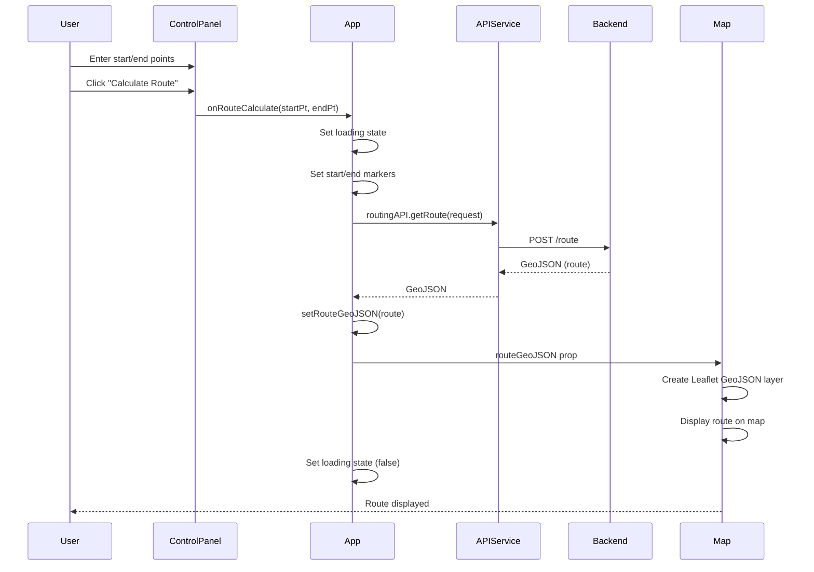
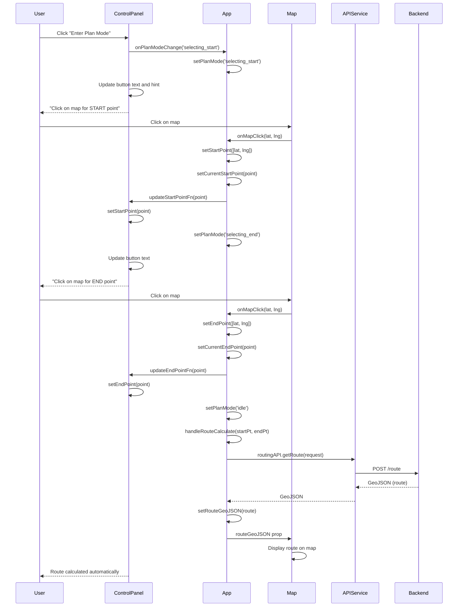
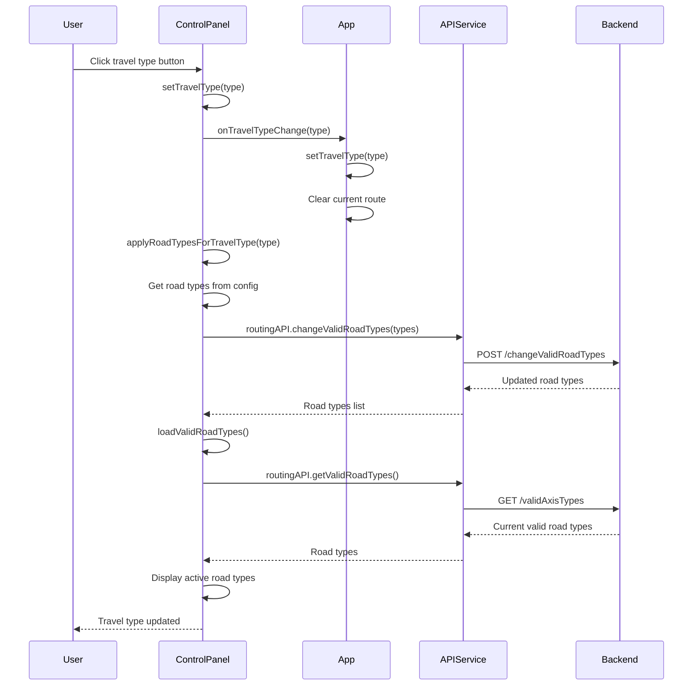
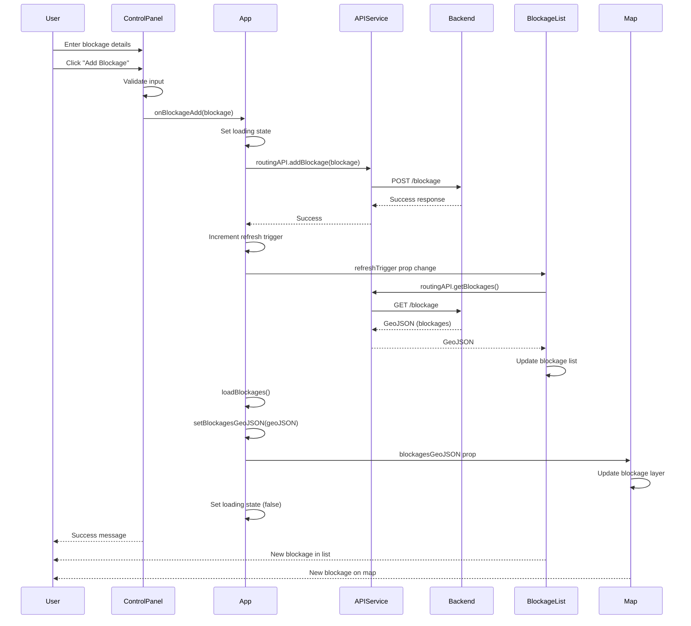
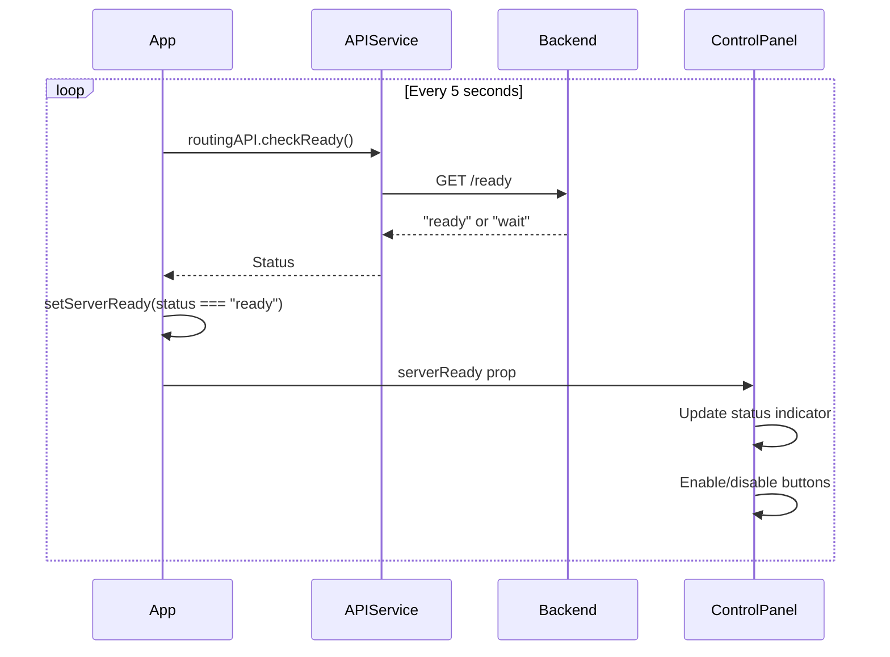
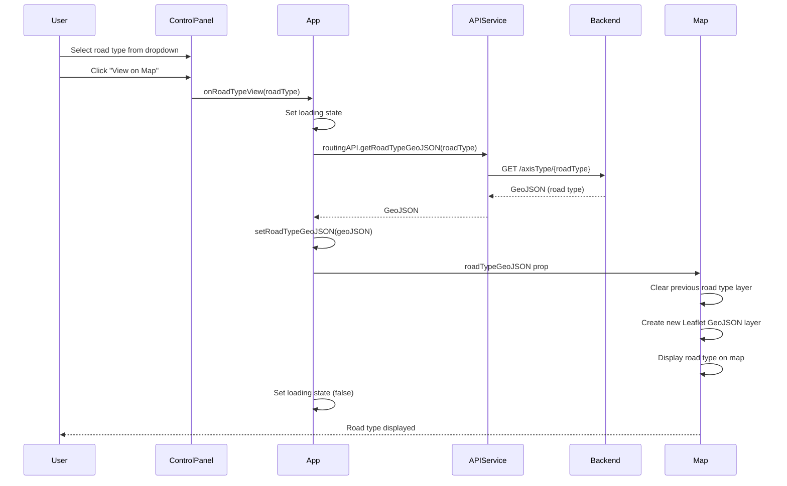

# Software Design Description

## Document Information

- **Document Version**: 1.0
- **Date**: 2024
- **Purpose**: Describe the software design of the SG Routing Application, including architecture, components, and sequence diagrams

## Overview

The SG Routing Application is a web-based routing application that provides route calculation and visualization for Singapore roads using OpenStreetMap data. The application follows a client-server architecture with a React-based frontend and RESTful API backend.

## Architecture

### High-Level Architecture

```
┌─────────────────────────────────────────────────────────┐
│                    Web Browser                           │
│  ┌──────────────────────────────────────────────────┐  │
│  │         React Application (Frontend)             │  │
│  │  ┌──────────┐  ┌──────────┐  ┌──────────┐      │  │
│  │  │   Map    │  │ Control  │  │ Blockage │      │  │
│  │  │Component │  │  Panel   │  │   List   │      │  │
│  │  └──────────┘  └──────────┘  └──────────┘      │  │
│  │         │             │              │           │  │
│  │         └─────────────┴──────────────┘          │  │
│  │                    │                             │  │
│  │            ┌───────────────┐                     │  │
│  │            │  API Service  │                     │  │
│  │            └───────────────┘                     │  │
│  └─────────────────────│─────────────────────────────┘  │
└────────────────────────┼─────────────────────────────────┘
                         │
                         │ HTTPS
                         │
┌────────────────────────┼─────────────────────────────────┐
│         Backend Services (Cloud Run)                    │
│  ┌──────────────────────┴──────────────────────┐        │
│  │  Routing Service                            │        │
│  │  - Route calculation                        │        │
│  │  - Road type management                     │        │
│  │  - Blockage management                      │        │
│  └─────────────────────────────────────────────┘        │
│  ┌─────────────────────────────────────────────┐        │
│  │  Bus Routing Service                         │        │
│  │  - Road type listing                        │        │
│  │  - Road type configuration                  │        │
│  └─────────────────────────────────────────────┘        │
└─────────────────────────────────────────────────────────┘
```

## Component Structure

### Frontend Components

```
App (Root Component)
├── ControlPanel
│   ├── Server Status Display
│   ├── Travel Type Selection
│   ├── Route Planning Inputs
│   ├── Road Type Viewer
│   └── Blockage Management Form
├── Map
│   ├── Leaflet Map Container
│   ├── Tile Layer (OpenStreetMap)
│   ├── Route Layer (GeoJSON)
│   ├── Blockage Layer (GeoJSON)
│   ├── Road Type Layer (GeoJSON)
│   └── Start/End Markers
└── BlockageList
    ├── Blockage Items Display
    ├── Minimize/Expand Functionality
    └── Delete Functionality
```

### Component Responsibilities

#### App Component
- **Purpose**: Main application container and state management
- **Responsibilities**:
  - Manage global application state
  - Coordinate between components
  - Handle API calls through service layer
  - Manage server readiness checking
  - Handle route calculation requests
  - Manage blockage operations

#### ControlPanel Component
- **Purpose**: User interface for all controls and inputs
- **Responsibilities**:
  - Display server status with visual indicators
  - Handle travel type selection with automatic road type configuration
  - Collect route planning inputs (manual entry and plan mode)
  - Manage plan mode state (idle, selecting_start, selecting_end)
  - Handle road type viewing
  - Handle blockage creation
  - Display active road types
  - Support collapsible panel functionality
  - Sync state with App component for map-selected points

#### Map Component
- **Purpose**: Display and interact with the map
- **Responsibilities**:
  - Render OpenStreetMap tiles
  - Display routes as GeoJSON layers
  - Display blockages as GeoJSON layers
  - Display road types as GeoJSON layers
  - Render start and end point markers
  - Handle map interactions (pan, zoom)

#### BlockageList Component
- **Purpose**: Display and manage blockages
- **Responsibilities**:
  - Fetch and display all blockages
  - Provide delete functionality
  - Support minimize/expand functionality
  - Update when blockages change
  - Display blockage count in header

### Service Layer

#### API Service (`src/services/api.ts`)
- **Purpose**: Encapsulate all backend API calls
- **Responsibilities**:
  - Provide typed interfaces for all API endpoints
  - Handle HTTP requests and responses
  - Manage error handling at the API level
  - Transform data as needed

## Data Flow

### Route Calculation Flow

**Method 1: Plan Mode (Map Click Selection)**
```
User clicks "Enter Plan Mode"
    ↓
ControlPanel (setPlanMode('selecting_start'))
    ↓
User clicks on map for START point
    ↓
Map Component (onMapClick)
    ↓
App Component (handleMapClick)
    ↓
- Updates startPoint state
- Updates ControlPanel via callback
- Sets planMode to 'selecting_end'
    ↓
User clicks on map for END point
    ↓
App Component (handleMapClick)
    ↓
- Updates endPoint state
- Updates ControlPanel via callback
- Sets planMode to 'idle'
- Automatically calls handleRouteCalculate
    ↓
API Service (routingAPI.getRoute)
    ↓
Backend API (POST /route)
    ↓
GeoJSON Response
    ↓
App Component (setRouteGeoJSON)
    ↓
Map Component (MapUpdater)
    ↓
Leaflet GeoJSON Layer
    ↓
Map Display
```

**Method 2: Manual Entry**
```
User Input (Start/End Points in input fields)
    ↓
ControlPanel Component
    ↓
User clicks "Calculate Route"
    ↓
App Component (handleRouteCalculate)
    ↓
API Service (routingAPI.getRoute)
    ↓
Backend API (POST /route)
    ↓
GeoJSON Response
    ↓
App Component (setRouteGeoJSON)
    ↓
Map Component (MapUpdater)
    ↓
Leaflet GeoJSON Layer
    ↓
Map Display
```

### Travel Type Change Flow

```
User Clicks Travel Type Button
    ↓
ControlPanel Component (setTravelType)
    ↓
App Component (handleTravelTypeChange)
    ↓
ControlPanel Component (applyRoadTypesForTravelType)
    ↓
API Service (routingAPI.changeValidRoadTypes)
    ↓
Backend API (POST /changeValidRoadTypes)
    ↓
Updated Road Types Response
    ↓
ControlPanel Component (display active road types)
```

## Sequence Diagrams

### Sequence Diagram 1: Route Calculation



### Sequence Diagram 2: Plan Mode Route Selection



### Sequence Diagram 3: Travel Type Selection



### Sequence Diagram 4: Add Blockage



### Sequence Diagram 5: Server Readiness Check



### Sequence Diagram 6: View Road Type



## State Management

### Application State

The application uses React's built-in state management with hooks:

#### App Component State
- **Server Status**: `serverReady` (boolean) - Backend server readiness
- **Loading State**: `loading` (boolean) - Loading state during API calls
- **Route Data**: `routeGeoJSON` (GeoJSON | null) - Calculated route GeoJSON
- **Blockages Data**: `blockagesGeoJSON` (GeoJSON | null) - All blockages GeoJSON
- **Road Type Data**: `roadTypeGeoJSON` (GeoJSON | null) - Currently viewed road type GeoJSON
- **Start Point (Map)**: `startPoint` ([number, number] | null) - Start point coordinates for map markers
- **End Point (Map)**: `endPoint` ([number, number] | null) - End point coordinates for map markers
- **Start Point (Route)**: `startPointForRoute` (Point | null) - Start point for route calculation
- **Current Start Point**: `currentStartPoint` (Point | null) - Start point selected via plan mode
- **Current End Point**: `currentEndPoint` (Point | null) - End point selected via plan mode
- **Plan Mode**: `planMode` ('idle' | 'selecting_start' | 'selecting_end') - Plan mode state
- **Panel Collapsed**: `isPanelCollapsed` (boolean) - Control panel collapse state
- **Travel Type**: `travelType` (TravelType) - Currently selected travel type
- **Blockage Refresh Trigger**: `blockageRefreshTrigger` (number) - Trigger for refreshing blockage list

#### ControlPanel Component State
- **Travel Type**: `travelType` (TravelType) - Local travel type state
- **Start Point**: `startPoint` (Point) - Start point input state
- **End Point**: `endPoint` (Point) - End point input state
- **Road Type**: `selectedRoadType` (string) - Selected road type for viewing
- **Blockage Form**: Form state for adding blockages

#### BlockageList Component State
- **Blockages**: `blockages` (Array) - List of blockages
- **Loading**: `loading` (boolean) - Loading state
- **Minimized**: `isMinimized` (boolean) - Minimize/expand state

### State Flow

State flows unidirectionally:
1. User interactions trigger events
2. Events update state in App component
3. State changes propagate to child components via props
4. Components re-render based on new props

## Technology Stack

### Frontend
- **React 18**: UI framework
- **TypeScript**: Type safety
- **Vite**: Build tool and dev server
- **Leaflet**: Map library
- **React-Leaflet**: React bindings for Leaflet
- **Axios**: HTTP client

### Backend (External)
- **Cloud Run**: Serverless container platform
- **RESTful API**: API architecture

### Map Data
- **OpenStreetMap**: Map tile provider
- **GeoJSON**: Geographic data format

## Design Patterns

### 1. Component Composition
- Components are composed hierarchically
- Each component has a single responsibility
- Components are reusable and testable

### 2. Service Layer Pattern
- API calls are abstracted in a service layer
- Components don't directly interact with APIs
- Easier to test and maintain

### 3. Props Drilling
- State is managed at the App level
- Props are passed down to child components
- Callbacks are passed for child-to-parent communication

### 4. Controlled Components
- Form inputs are controlled by React state
- State is the single source of truth
- Changes flow through state updates

### 5. Callback Pattern
- Parent components pass callback functions to children
- Children invoke callbacks to update parent state
- Used for plan mode point selection synchronization
- Enables bidirectional communication between App and ControlPanel

## Error Handling Strategy

1. **API Level**: Errors are caught in the API service
2. **Component Level**: Errors are handled with try-catch blocks
3. **User Feedback**: Error messages are displayed via alerts
4. **Graceful Degradation**: Application continues to function when non-critical features fail

## Performance Considerations

1. **Lazy Loading**: Map components load on demand
2. **Debouncing**: Server status checks are interval-based, not continuous
3. **Layer Management**: Map layers are properly cleaned up to prevent memory leaks
4. **Efficient Re-renders**: React's reconciliation minimizes unnecessary re-renders

## Security Considerations

1. **Input Validation**: User inputs are validated before sending to backend
2. **HTTPS**: All API calls use HTTPS
3. **Error Messages**: Error messages don't expose sensitive information
4. **CORS**: Backend handles CORS appropriately

## Future Enhancements

Potential improvements:
1. State management library (Redux, Zustand) for complex state
2. Route caching to reduce API calls
3. Offline support with service workers
4. Route optimization options
5. Multiple route alternatives
6. Route sharing functionality
7. User preferences persistence
8. Advanced filtering options

---

**Document End**

